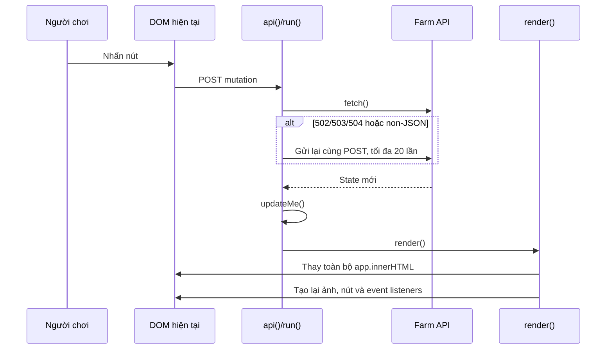
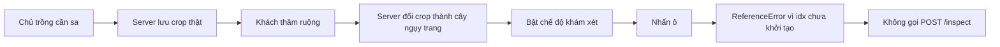
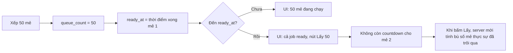
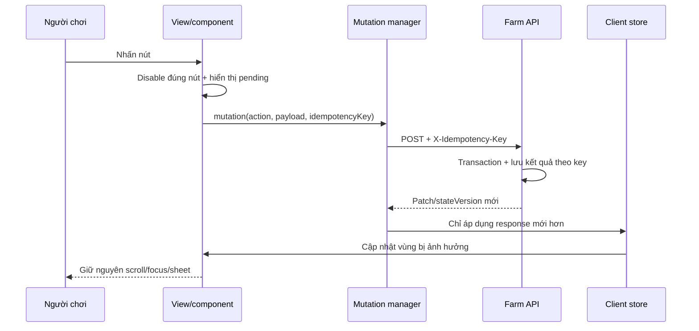

# Roadmap ổn định NTVV trước đợt release tiếp theo

## 1. Mục tiêu và nguyên tắc release

Mục tiêu của đợt này là biến game từ mô hình “render lại toàn trang sau mỗi lệnh” thành một ứng dụng có cập nhật trạng thái dự đoán được, không nhân đôi giao dịch, không mất tương tác sau khi server ngủ/thức và có đủ telemetry để điều tra lỗi production.

Release tiếp theo chỉ nên phát hành khi đạt đủ các điều kiện:

- Không còn lỗi P0/P1 mở.
- Mọi POST thay đổi vàng, kim cương, inventory hoặc tiến trình đều có test chống gọi lặp.
- Cold start không ép reload tab đang mở nếu client và server vẫn cùng phiên bản build.
- Các thao tác chính không thay toàn bộ DOM và không làm mất scroll/focus/sheet đang mở.
- Flow cần sa có test end-to-end: trồng → ngụy trang → khám đúng/sai → thưởng/phạt → đồng bộ hai người chơi.
- Có dashboard tối thiểu cho error rate, latency, cold start, duplicate mutation và client reload.

## 2. Tóm tắt phát hiện theo độ ưu tiên

| Ưu tiên | Vấn đề | Ảnh hưởng | Bằng chứng |
|---|---|---|---|
| P0 | Retry cả POST sau gateway/non-JSON response | Có thể trừ/cộng vàng, mua, thu hoạch hoặc nhận thưởng nhiều lần | `public/app.js:71-109` |
| P0 | Khám xét cần sa dùng `idx` trước khi khai báo | Nhấn khám xét luôn văng `ReferenceError`, request không được gửi | `public/app.js:1698-1713` |
| P0 | Version sinh theo mỗi lần process boot | Scale-to-zero/cold start làm tab cũ tự reload dù không deploy code mới | `server/src/app.js:2233`, `public/app.js:63-68` |
| P0 | Queue chế biến dùng một `ready_at` cho cả 50 mẻ | Sau mẻ đầu, UI coi cả job là đã xong và không thể hiện mẻ kế tiếp đang chạy; số “Lấy 50” cũng sai | `server/src/app.js:1371-1393`, `server/src/app.js:1422-1445`, `public/app.js:1018-1032` |
| P1 | `render()` thay toàn bộ `app.innerHTML` | UI nhấp nháy/load lại, ảnh và DOM được tạo lại, mất focus, phải gắn lại toàn bộ event | `public/app.js:282-321` |
| P1 | Refresh nền có thể đua với mutation | Response `/state` cũ có thể ghi đè state mới vừa nhận từ thao tác | `public/app.js:1757-1773`, `public/app.js:1843-1848` |
| P1 | Một cờ `pending` khóa toàn ứng dụng | Một request chậm khiến mọi nút khác im lặng, người chơi tưởng nút hỏng | `public/app.js:243-252` |
| P1 | Fetch tới Chat và avatar không timeout | Request Farm có thể treo, tích tụ kết nối khi Chat lỗi | `server/src/app.js:98-114`, `server/src/app.js:782-788`, `server/src/app.js:2218-2226` |
| P1 | Không có automated test | Không có hàng rào chống regression cho nền kinh tế và gameplay | `package.json` không có script `test` |
| P2 | Không rate limit và không schema hóa request/response | Dễ spam API; dữ liệu số lẻ/sai kiểu lọt vào DB | Ví dụ `/buy` tại `server/src/app.js:1294-1305` |
| P2 | Poll `/state` trả và so sánh object lớn | Tốn DB/JSON/network, stringify state để phát hiện thay đổi | `public/app.js:1757-1764` |
| P2 | Thiếu error boundary và mã tương quan | Client nuốt lỗi trong `run()`, khó biết nút nào lỗi ở production | `public/app.js:243-252` |
| P2 | Thiếu security headers/CSRF strategy rõ ràng | Tăng rủi ro clickjacking và mutation ngoài ý muốn | `server/src/app.js:2242-2253` |

## 3. Flow hiện tại và nguyên nhân lỗi

### 3.1 Flow thao tác nút hiện tại

Ba vấn đề chính của flow này:

1. Retry không phân biệt lệnh đọc và lệnh ghi.
2. Mọi mutation đều kéo theo full render.
3. Nếu server vừa thức dậy với boot ID mới, client reload toàn trang trước khi hoàn tất trải nghiệm người dùng.

### 3.2 Flow cần sa hiện tại

Server đã có logic ngụy trang và phát hiện tương đối đầy đủ. Lỗi “không detect được cần sa” trước hết là lỗi client chặn request, không phải thuật toán xác định `risky` phía server. Tuy nhiên flow server vẫn cần test để bảo đảm không lộ crop thật và xử lý đúng giới hạn lượt.

### 3.3 Flow queue khu chế biến hiện tại

Backend hiện không hoàn toàn làm mất thời gian sản xuất: lúc thu, `collectJobs()` tính `done = 1 + floor((now - ready_at) / cycle)` rồi dời `ready_at` sang mẻ tiếp theo. Nhưng contract trả cho client chỉ có `ready`, `readyAt` và `queue`; vì vậy ba trạng thái khác nhau bị gộp làm một:

- Thành phẩm đã xong và đang chờ thu.
- Một mẻ hiện đang chế biến.
- Các mẻ còn xếp hàng.

Đây là lỗi gameplay/contract, không nên chỉ sửa dòng chữ trên UI. Queue đúng phải tiếp tục chạy sau khi mẻ đầu hoàn thành, bất kể người chơi đã thu thành phẩm hay chưa.

## 4. Flow mục tiêu

Quy tắc của flow mới:

- GET có thể retry với backoff và jitter; POST không tự retry nếu chưa có idempotency key.
- Mỗi mutation có `requestId`, `stateVersion` và kết quả có thể replay an toàn.
- Chỉ khóa control đang chạy, không khóa cả app.
- UI cập nhật theo vùng: HUD, plot, inventory hoặc sheet liên quan.
- Poll/refresh không được ghi đè một mutation có version mới hơn.
- Build ID ổn định trong suốt một artifact/deploy, không đổi theo process restart.

## 5. Roadmap triển khai

### Giai đoạn 0 — Hotfix khẩn cấp (P0, 0.5–1 ngày)

1. Di chuyển khai báo `idx` lên trước nhánh khám xét.
2. Chỉ retry tự động cho GET. Với POST, hiển thị trạng thái “chưa xác nhận” và yêu cầu đồng bộ `/state` trước khi cho thao tác lại.
3. Thay `BOOT_VERSION = Date.now()` bằng `APP_RELEASE`/Git SHA được inject lúc build. Nếu thiếu biến, dùng hash nội dung asset thay vì thời điểm process boot.
4. Thêm log client cho `location.reload()` với reason: `release_mismatch`, `wake_timeout`, `route_mismatch`.
5. Sửa view khu chế biến để không hiển thị `Lấy 50` khi mới chỉ một mẻ hoàn thành. Trong hotfix có thể tính và trả riêng `completed`, `processing` và `queued` từ `ready_at`, `queue_count` và cycle hiện tại.

Tiêu chí nghiệm thu:

- Khám xét gửi đúng `ownerId` và `idx` trên Chrome/Safari mobile.
- Mô phỏng response 502 cho POST không tạo request mutation thứ hai.
- Restart process với cùng artifact không reload tab; deploy artifact mới reload đúng một lần.
- Queue 50 mẻ hiển thị lần lượt: `1 thành phẩm · mẻ 2 đang chạy · 48 đang chờ`, rồi tự tăng số thành phẩm mà không cần bấm thu.

### Giai đoạn 1 — Ổn định state và render (P1, 2–4 ngày)

1. Tách client state thành `session`, `farm`, `visit`, `config`, `ui` và `requests`.
2. Thay full `app.innerHTML` bằng cập nhật theo vùng. Có thể làm tăng dần, chưa cần đổi framework:
   - Render shell một lần.
   - `renderHud()`, `renderPlots()`, `renderSheet()`, `renderFamily()` chỉ chạy khi slice tương ứng đổi.
   - Dùng event delegation ở root thay vì gắn lại hàng trăm listener sau mỗi render.
3. Thay `pending` global bằng map theo action/resource, ví dụ `plant:12`, `harvest:12`, `gold-give:42`.
4. Thêm sequence/version cho request. Bỏ response cũ nếu `response.stateVersion < store.stateVersion`.
5. Hủy refresh đang chạy khi mutation bắt đầu hoặc hợp nhất refresh qua một request coordinator.
6. Giữ focus, scroll, sheet và animation bằng DOM ổn định thay vì capture/restore sau full render.

Tiêu chí nghiệm thu:

- Nhấn trồng/thu hoạch không thay node `.stage` và không tải lại avatar/ảnh nền.
- Có thể mở/đóng sheet trong khi một plot đang pending.
- Test race “refresh chậm, mutation nhanh” không rollback UI.
- Không có listener tăng dần sau 100 thao tác.

### Giai đoạn 2 — Chính xác nghiệp vụ và test (P1, 3–5 ngày)

Thiết lập `node:test` hoặc Vitest và Fastify injection với SQLite tạm. Tối thiểu phải có các suite:

- Auth: thiếu cookie, Chat timeout, user không hợp lệ.
- Idempotency: cùng key cho `buy`, `sell`, `gold-give`, `harvest`, `claim`, `want-fill` chỉ có hiệu lực một lần.
- Economy invariants: vàng/inventory không âm; tổng vàng chuyển giữa người chơi được bảo toàn; quantity luôn là số nguyên.
- Concurrency: hai request cùng thu hoạch/nhận thưởng/điền đơn không trả thưởng hai lần.
- Cần sa:
  - Chủ thấy crop thật, khách chỉ thấy disguise ổn định.
  - Khám đúng ô xóa crop và trả bounty đúng một lần.
  - Khám sai ghi action, trừ fee đúng một lần và giảm lượt.
  - Không khám ruộng mình, cây ăn quả hoặc ô trống.
  - Không vượt giới hạn theo ngày; xác định rõ “ngày lịch” hay cửa sổ 24 giờ.
- Khu chế biến:
  - Xếp 50 mẻ chỉ trừ nguyên liệu đúng một lần và lưu đủ 50 mẻ.
  - Hoàn thành mẻ 1 không chặn thời điểm bắt đầu/kết thúc mẻ 2.
  - Không thu trong 10 chu kỳ thì `completed = 10`, một mẻ tiếp tục chạy và phần còn lại vẫn queued.
  - Thu thành phẩm chỉ lấy số đã hoàn thành, không lấy luôn toàn bộ queue.
  - Thu giữa chu kỳ không reset hoặc kéo dài thời gian còn lại của mẻ đang chạy.
  - Restart/cold start và thời gian offline vẫn tính đúng số mẻ đã hoàn thành.
  - Speed-up chỉ tác động mẻ đang chạy; định nghĩa rõ có áp dụng cho các mẻ kế tiếp hay không.
  - Hai request thu đồng thời không nhân đôi output hoặc EXP.
- Cold start: cùng release ID không reload; release mới reload một lần.
- Client: nút lỗi hiển thị lỗi và trở lại trạng thái usable.

### Giai đoạn 3 — Resilience và observability (P1/P2, 2–3 ngày)

1. Timeout upstream Chat 3–5 giây bằng `AbortSignal.timeout()`; circuit breaker đơn giản cho `/api/users` và avatar.
2. Rate limit theo user và endpoint; mutation kinh tế chặt hơn read API.
3. Structured logging với `requestId`, `userId`, route, latency, release và idempotency key; không log cookie/secret.
4. Client error reporting tối thiểu: release, route/action, error code, online state và reload reason.
5. Metrics:
   - `http_requests_total`, latency p50/p95/p99.
   - `mutation_duplicate_total` và `mutation_unknown_outcome_total`.
   - `client_reload_total{reason}`.
   - Chat timeout/error rate.
   - SQLite busy/transaction failure.
6. Health/readiness tách biệt: health chỉ cho biết process sống; readiness xác minh DB dùng được.

### Giai đoạn 4 — Hardening và tối ưu (P2/P3, 2–4 ngày)

1. Fastify JSON Schema cho params/body/response; reject `NaN`, số thập phân và payload vượt giới hạn.
2. Security headers: CSP, `frame-ancestors`, `nosniff`, referrer policy; xác minh cookie `Secure`, `HttpOnly`, `SameSite` ở Chat.
3. Origin/CSRF protection cho mutation nếu cookie có thể gửi cross-site.
4. Cache config tĩnh ở client; mutation chỉ trả patch cần thiết thay vì toàn bộ farmer view.
5. Dùng ETag/state cursor hoặc event delta cho polling; cân nhắc SSE/WebSocket sau khi flow request ổn định.
6. Pin image base theo digest, thêm Docker healthcheck và CI build trên đúng Node 22.
7. Tối ưu asset: bỏ asset nguồn khỏi production context/image, nén ảnh lớn và thêm `.dockerignore`.

## 6. Những điểm cần cải tiến thêm

### Trải nghiệm người chơi

- Mỗi nút cần ba trạng thái rõ ràng: idle, pending và success/error; không được “im lặng” vì cờ pending global.
- Với mutation chưa biết kết quả do mất mạng, hiển thị “Đang đối chiếu…” rồi fetch state, không cho người chơi bấm lặp mù.
- Giữ nguyên sheet, scroll, input và animation sau thao tác.
- Chuẩn hóa thông báo lỗi theo hành động; không biến mọi lỗi thành “Có lỗi rồi”.
- Thêm trạng thái offline và nút thử lại chủ động.

### Gameplay và dữ liệu

- Xác định invariant chính thức cho vàng, gem, quantity, slot, daily counters và ghi chúng thành assertion/test.
- Dùng unique constraint/ledger cho reward một lần thay vì chỉ dựa vào check-then-update trong application code.
- Có migration version table; hiện migration dựa vào kiểm tra cột rời rạc, khó rollback/audit.
- Backup SQLite định kỳ và kiểm thử restore; đặt retention cho WAL/backup.
- Dùng clock abstraction trong game logic để test ngày mới, cooldown và fast mode mà không phụ thuộc `Date.now()` thật.
- Tách trạng thái job chế biến thành contract rõ ràng: `completedCount`, `currentStartedAt`, `currentReadyAt`, `queuedCount`; không dùng một `queue_count` vừa đại diện số đang chờ vừa đại diện số có thể thu.
- Chọn và ghi rõ giới hạn kho thành phẩm. Nếu không giới hạn, máy tiếp tục chạy và thành phẩm tích lũy khi offline; nếu có giới hạn, UI phải báo “kho đầu ra đầy” thay vì trông như bị dừng bí ẩn.

### Kiến trúc client

- Tách API transport khỏi UI rendering và gameplay presentation.
- Không dùng response toàn phần làm implicit state contract; định nghĩa DTO/version rõ ràng.
- Gom event handling về root bằng delegation.
- Không dùng `innerHTML` cho dữ liệu runtime nếu có thể dùng `textContent`; giữ `esc()` như lớp phòng thủ bổ sung.
- Thêm smoke test trình duyệt bằng Playwright cho mobile viewport và thao tác cảm ứng.

### Quy trình release

- CI bắt buộc: install sạch trên Node 22, lint, unit, integration, browser smoke, `npm audit`, Docker build và migration test.
- Staging dùng bản sao dữ liệu đã ẩn danh và cùng topology caddy/sablier như production.
- Canary cho một nhóm người chơi; theo dõi reload/error/duplicate mutation ít nhất 30 phút trước rollout toàn bộ.
- Có feature flag để tắt riêng cần sa, trộm, marketplace hoặc economy action mà không phải rollback toàn app.
- Rollback artifact phải giữ tương thích DB; migration phá vỡ cần theo chiến lược expand/contract.

## 7. Kế hoạch handoff

### Workstream A — Client/state

Owner đề xuất: frontend engineer.

Deliverables:

- Sửa flow `api()`/retry và boot version handling.
- Request coordinator + per-action pending.
- Incremental render và event delegation.
- Playwright tests cho click, scroll, cold start và cần sa.

### Workstream B — Server/economy

Owner đề xuất: backend engineer.

Deliverables:

- Idempotency middleware/store.
- `stateVersion` hoặc monotonic revision.
- Schema validation, timeout Chat, rate limit.
- Test invariants và concurrency cho tất cả mutation có giá trị.
- Chuẩn hóa state machine của khu chế biến và migration dữ liệu job đang chạy mà không làm mất queue hiện có.

### Workstream C — Platform/release

Owner đề xuất: platform/DevOps.

Deliverables:

- Inject `APP_RELEASE` từ Git SHA/build ID.
- CI Node 22 + Docker + migration test.
- Metrics/log dashboard, alert và canary/rollback runbook.
- Backup/restore rehearsal cho SQLite.

### Thứ tự tích hợp bắt buộc

1. Hotfix `idx`, bỏ retry POST và ổn định release ID.
2. Thêm test hiện trạng trước khi refactor render/state.
3. Server idempotency + state version.
4. Client request coordinator + incremental render.
5. Resilience, observability và security hardening.
6. Canary rồi mới rollout toàn bộ.

## 8. Checklist go/no-go

- [ ] Không có POST tự retry nếu thiếu idempotency key.
- [ ] Không còn `Date.now()` làm release/build ID.
- [ ] Flow cần sa pass toàn bộ integration và browser tests.
- [ ] Queue 50 mẻ tiếp tục chạy sau từng mẻ và hiển thị đúng completed/processing/queued.
- [ ] Restart server cùng artifact không reload client.
- [ ] 100 thao tác liên tục không tăng listener/DOM node ngoài dự kiến.
- [ ] Race refresh/mutation không làm state lùi.
- [ ] Chat timeout không treo request Farm quá ngưỡng.
- [ ] Dashboard hiển thị được reload reason và duplicate mutation.
- [ ] Backup restore thành công trên staging.
- [ ] Canary không có lỗi P0/P1 trong cửa sổ quan sát.
